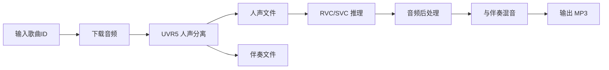

# RVCSVC-API 🎤

一个基于 Gradio 的 AI 翻唱工具集，支持 RVC（Retrieval-based Voice Conversion）和 SoVITS-SVC 两种主流声音转换模型，提供自动下载、人声分离、音色转换、混音等一站式翻唱服务。

## ✨ 特性

- 🎵 **双引擎支持**：同时支持 RVC 和 SoVITS-SVC 模型
- 🔄 **自动化流程**：自动下载网易云音乐 → 人声伴奏分离 → AI 音色转换 → 智能混音
- 🎛️ **专业音效处理**：内置 EQ、压缩器、混响等音频处理链
- 🌐 **Web UI + API**：既可通过浏览器操作，也支持外部程序调用
- 🔍 **智能匹配**：自动模糊匹配模型配置文件和索引文件
- 💾 **智能缓存**：已处理的歌曲会自动缓存，避免重复下载

## 📦 项目结构

```
RVCSVC-API/
├── app_rvc.py # RVC 版本主程序
├── app_svc.py # SoVITS-SVC 版本主程序
├── requirements.txt # Python 依赖
├── uvr5/ # 人声分离模块
│ └── uvr_model/ # UVR5 模型文件
├── output/ # 分离后的人声/伴奏缓存目录
└── temp/ # 最终输出文件目录
```

## 🚀 快速开始

### 1. 环境要求

- Python 3.10+
- CUDA 11.8+ (如果使用 GPU)
- 至少 4GB RAM

### 2. 安装依赖

```bash
# 克隆项目
git clone https://github.com/your-username/RVCSVC-API.git
cd RVCSVC-API

# 安装依赖
pip install -r requirements.txt
```

**requirements.txt 内容：**
```txt
--extra-index-url https://download.pytorch.org/whl/cu118
torch==2.3.1
torchaudio==2.3.1
librosa==0.9.2
numpy==1.23.5
resampy
soundfile
pydub
gradio
requests
tqdm
pedalboard
```

### 3. 准备模型文件

#### 使用 RVC (app_rvc.py)

1. 启动 RVC WebUI（假设运行在 `http://127.0.0.1:7897`）
2. 在 RVC WebUI 中加载你的模型
3. 确保 `app_rvc.py` 中的 `RVC_API_BASE` 设置正确

#### 使用 SoVITS-SVC (app_svc.py)

1. 启动 so-vits-svc WebUI（假设运行在 `http://127.0.0.1:7865`）
2. 在 SVC WebUI 中放置模型文件
3. 确保 `app_svc.py` 中的 `SVC_API_BASE` 设置正确

### 4. 启动服务

```bash
# 启动 RVC 版本
python app_rvc.py

# 或启动 SVC 版本
python app_svc.py

# CPU 模式（无 GPU）
python app_rvc.py --is_nohalf
```

**⏳ 首次启动时会自动下载 UVR5 人声分离模型（约 120MB），请耐心等待。**

启动成功后，访问控制台输出的链接（通常是 `http://127.0.0.1:7860`）。

访问控制台输出的链接（通常是 `http://127.0.0.1:7860`）即可使用 Web 界面。

## ⚠️ 重要配置与文件管理

**📌 启动前请务必阅读：[使用说明.md](./使用说明.md)**

核心要点：
- ✅ 必须先启动 RVC/SVC WebUI，再启动 API 服务
- ✅ 模型文件直接放在指定目录，不要嵌套文件夹
- ✅ Index 文件需重命名为与模型名一致
- ✅ SVC 需切换到"独立目录模式"

详细说明请查看 [使用说明.md](./使用说明.md)

## 💻 使用方法

### Web 界面使用

1. **刷新模型列表**：点击 🔄 按钮加载可用模型
2. **选择/加载模型**：从下拉菜单选择模型，点击 ✨ 切换/✅ 加载
3. **输入歌曲**：填写网易云音乐 ID 或完整链接（如 `114514` 或 `https://music.163.com/song?id=114514`）
4. **调整参数**：
- 升降调：-12 至 +12（推荐男转女 +12，女转男 -12）
- 人声/伴奏音量：-10dB 至 +10dB
5. **开始转换**：点击 💕 按钮，等待处理完成

### API 调用

```python
from gradio_client import Client

# RVC 版本 (端口 7860)
client = Client("http://127.0.0.1:7860/")
result = client.predict(
"114514", # 网易云歌曲 ID
0, # 升降调 (半音)
0, # 人声音量 (dB)
0, # 伴奏音量 (dB)
"yuki.pth", # 模型名称
api_name="/convert"
)

# SVC 版本 (端口 7866)
client = Client("http://127.0.0.1:7866/")
result = client.predict(
"114514",
0,
0,
0,
"aoi.pth",
api_name="/convert"
)
```

### 获取模型列表 API

```python
# RVC 版本 (端口 7860)
client = Client("http://127.0.0.1:7860/")
result = client.predict(
	api_name="/show_model"
)
print(result) # ['aoi.pth', 'karen.pth', ...]

# SVC 版本 (端口 7866)
client = Client("http://127.0.0.1:7866/")
result = client.predict(
	api_name="/show_model"
)
print(result) # ['aoi.pth', 'karen.pth', ...]
```

## ⚙️ 配置说明

### RVC 版本 (app_rvc.py)

```python
RVC_API_BASE = "http://127.0.0.1:7897" # RVC WebUI 地址
```

### SVC 版本 (app_svc.py)

```python
SVC_API_BASE = "http://127.0.0.1:7865" # SVC WebUI 地址
TIMEOUT = 240 # API 超时时间（秒）
```

### 音频处理参数

两个版本都内置了相同的音频处理链：

```python
Pedalboard([
HighpassFilter(cutoff_frequency_hz=80), # 高通滤波
PeakFilter(cutoff_frequency_hz=200, gain_db=1.5, q=0.7), # 低频增强
PeakFilter(cutoff_frequency_hz=3000, gain_db=2.0, q=1.0), # 中频增强
PeakFilter(cutoff_frequency_hz=7000, gain_db=-3.0, q=2.0), # 高频衰减
LowpassFilter(cutoff_frequency_hz=16000), # 低通滤波
Compressor(threshold_db=-18.0, ratio=4.0, attack_ms=5.0, release_ms=150.0),
Reverb(room_size=0.50, damping=0.4, wet_level=0.3, dry_level=0.7, width=0.7)
])
```

可根据需要在代码中调整这些参数。

## 🎯 工作原理



1. **下载**：从网易云音乐获取原始音频（支持双下载源备份）
2. **分离**：使用 UVR5 算法分离人声和伴奏
3. **转换**：将人声通过 RVC 或 SVC 模型转换为目标音色
4. **处理**：应用 EQ、压缩、混响等专业音效
5. **混音**：将处理后的人声与原伴奏混合
6. **导出**：输出高质量 MP3 文件

## 🔧 高级功能

### 智能文件匹配

程序会自动查找与模型名称最相似的配置文件：

```python
# 示例：加载 "yuki_v2.pth" 时
# 自动匹配 "yuki_v2.json" (配置文件)
# 自动匹配 "yuki_v2_index.index" (RVC 索引)
# 自动匹配 "yuki_v2_diffusion.pt" (SVC 扩散模型)
```

相似度阈值默认为 40%，可在代码中调整 `threshold` 参数。

### 缓存机制

已处理过的歌曲人声/伴奏会缓存到 `output/` 目录：

```
output/UVR-HP5/114514/
├── vocal_114514.wav_10.wav # 人声
└── instrument_114514.wav_10.wav # 伴奏
```

再次使用同一首歌时会跳过下载和分离步骤。

### CPU 模式

如果没有 GPU，可使用 `--is_nohalf` 参数：

```bash
python app_rvc.py --is_nohalf
python app_svc.py --is_nohalf
```

## 📝 常见问题

### Q: 提示 "未能加载模型列表"

**A:** 确保 RVC/SVC 的后端服务正在运行，并且端口配置正确。

### Q: API 调用返回 "Value is not in the list of choices"

**A:** 使用专用的 API 端点 `api_name="/convert"`，它接受任意模型名称字符串。

### Q: 音频质量不佳

**A:** 尝试调整：
- 升降调参数（避免转换跨度过大）
- 音频处理链参数（代码中的 `Pedalboard` 部分）
- 使用更高质量的训练模型

### Q: 下载歌曲失败

**A:** 项目内置了主备两个下载源，如果都失败：
- 检查网络连接
- 确认歌曲 ID 正确
- 尝试 VPN（某些地区可能被限制）

## 📄 许可证

本项目仅供学习、研究和个人娱乐使用。请勿用于任何商业用途或生成侵害他人权益的内容。

使用本项目生成的音频内容，使用者需自行承担法律责任。

## 🙏 致谢

- [RVC-Project](https://github.com/RVC-Project/Retrieval-based-Voice-Conversion-WebUI) - RVC 模型
- [so-vits-svc](https://github.com/svc-develop-team/so-vits-svc) - SVC 模型
- [Ultimate Vocal Remover](https://github.com/Anjok07/ultimatevocalremovergui) - 人声分离
- [Gradio](https://github.com/gradio-app/gradio) - Web 界面框架
